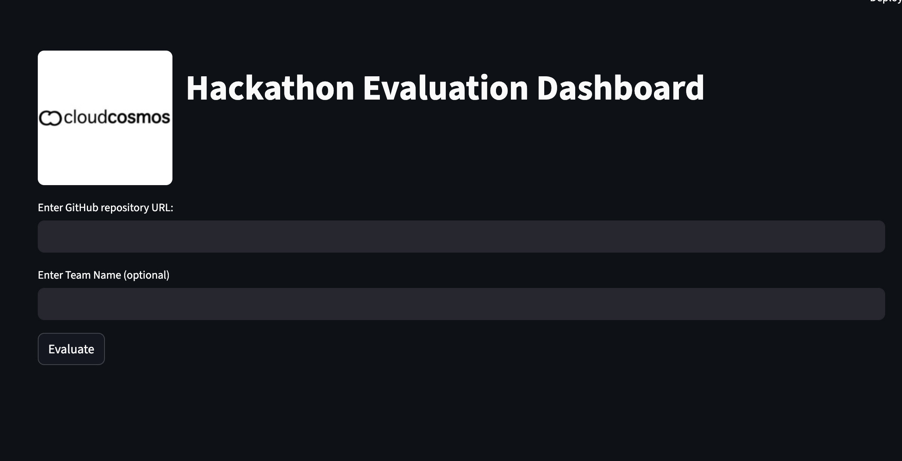
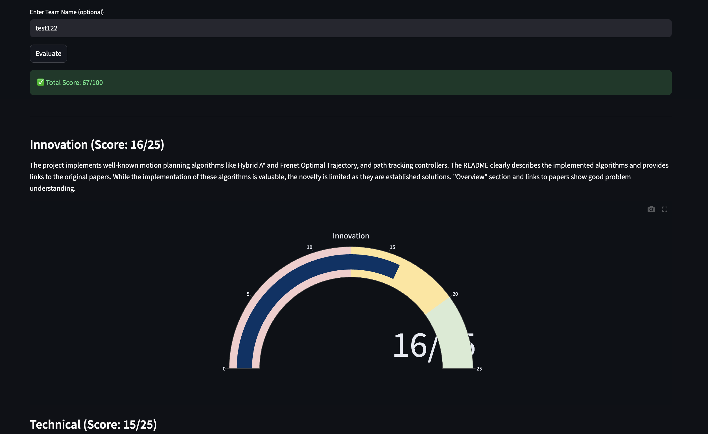
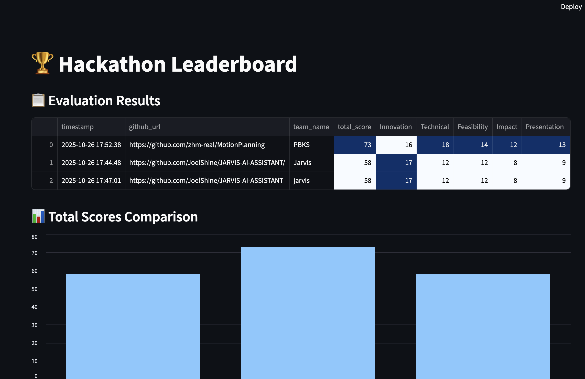

# Hackathon Evaluation Dashboard

A web-based dashboard for evaluating hackathon submissions using multi-agent evaluation. The dashboard provides scores and detailed feedback with citations for each evaluation category.

---

## Features

- Evaluate GitHub repositories for hackathon submissions.
- Objective scoring across five categories:
  - Innovation & Problem Understanding (25 pts)
  - Technical Depth & Code Quality (25 pts)
  - Feasibility & Completeness (20 pts)
  - Impact & Scalability (15 pts)
  - Presentation & Communication (15 pts)
- Displays detailed feedback for each category.

---

## Installation

1. **Clone the repository**

```bash
git clone https://github.com/yourusername/hackathon-evaluation-dashboard.git
cd hackathon-evaluation-dashboard
````

2. **Create a virtual environment (recommended)**

```bash
python -m venv venv
source venv/bin/activate      # Linux / Mac
venv\Scripts\activate         # Windows
```

3. **Install dependencies**

```bash
pip install -r requirements.txt
```

---

## Usage

### 1. Run the backend evaluation service

Make sure your evaluation API is running (default: `http://localhost:8000/evaluate`). Example:

```bash
uvicorn app.main:app --reload
```

### 2. Run the Streamlit dashboard

```bash
streamlit run app_streamlit.py
```

* Enter the GitHub repository URL in the input box.
* Click **Evaluate** to see category-wise scores and speedometer gauges.
* View detailed feedback for each evaluation criterion.

---

## Evaluation Criteria

| Category                           | Weight |
| ---------------------------------- | ------ |
| Innovation & Problem Understanding | 25     |
| Technical Depth & Code Quality     | 25     |
| Feasibility & Completeness         | 20     |
| Impact & Scalability               | 15     |
| Presentation & Communication       | 15     |


## Screenshot



